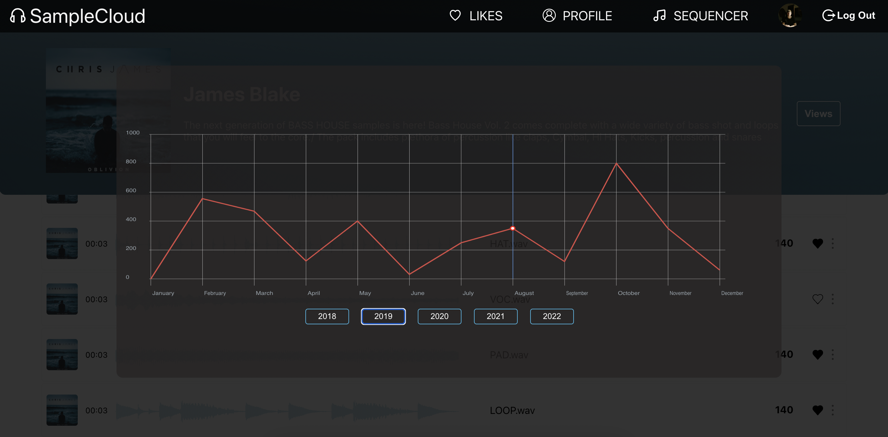
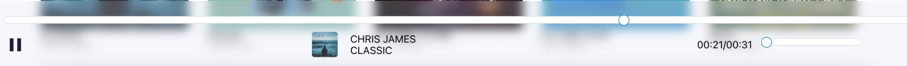
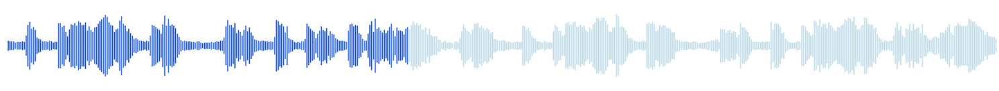

# SAMPLE CLOUD

## Установка

[client](https://github.com/Georgy87/SPLICE_PL_CLIENT-REACT): `npm run start`
<br/>
[server](https://github.com/Georgy87/SPLICE_PL_SERVER): `npm run start`

## Оглавление

1. [Описание проекта](#Описание-проекта)
2. [Регистрация](#Регистрация)
3. [Вход](#Вход)
4. [Главная страница](#Главная-страница)
5. [Профайл библиотеки](#Профайл-библиотеки)
6. [Профайл пользователя](#Профайл-пользователя)
    - [Редактирование аватара](#Редактирование-аватара)
    - [Редактирование почты и инициалов пользователя](#Редактирование-почты-и-инициалов-пользователя)
    - [Создание библиотеки](#Создание-библиотеки)
    - [Загрузка семплов в библиотеку](#Загрузка-семплов-в-библиотеку)
7. [Секвенсор](#Секвенсор)
8. [Оптимизации](#Оптимизации)
    - [Загрузка файлов](#Загрузка-файлов)
    - [Webworker](#Webworker)
    - [Audio player](#Audio-player)
    - [Визуализация семпла](#Визуализация-семпла)
    - [Кроссбраузерность](#Кроссбраузерность)
    - [Движок секвенсора](#Движок-секвенсора)

## `Описание проекта`

SAMPLE CLOUD - это платформа для использования и создания библиотек с сэмплами. Платформа является источником для творчества музыкантов, саундпродюссеров, битмейкеров, звукоинженеров, а также просто любителей музыки. Библиотеки с семплами созданы в самых разнообразных жанрах: от хип-хопа, хауса, техно, кинематографии до классической музыки.

## `Регистрация`


## `Вход`

Вход в приложение по email и паролю:
email: test@gmail.com
пароль: 12345678


## `Главная страница`

При удачной авторизации мы попадаем на главную страницу платформы. Здесь можно найти и прослушать демо библиотек с семплами(Packs).

<br/>


<br/>

`Поиск осуществляется по жанрам, а также авторам библиотек.`


`При нажатии на иконку play открывается плеер и включается проигрывание демо библиотеки.`


## `Профайл библиотеки`

`Выбрав библиотеку на странице main page открываем профайл с семплами.`


`Категорию семплов можно фильтровать по тегам`

`При наведении на семпл появляется возможность прослушать его, а также перемотать в нужное место при проигрывании.`

[демо](https://disk.yandex.ru/i/OJFzGtyJR7_Pkw)

Добавить категорию семпла, а также его bpm можно в модальном окне, которое открывается при нажатии на крайний правый вертикальный эллипсис семпла:


Также в профайле библиотеки возможно посмотреть ежемесячную статистику просмотров:



## `Профайл пользователя`

Страница для редактирования профайла пользователя.


<br/>

#### `Редактирование аватара`


<br/>


`Все, что нам нужно, это сделать дроп изображения. В результате получаем возможность вырезать нужный фрагмент из фото и сохранить результат.`


#### `Редактирование почты и инициалов пользователя`


<br/>

#### `Создание библиотеки`

-   Заполняем форму(pack information).

>

<br/>

-   Загружаем обложку для библиотеки.

>

<br/>

-   Загружаем аудио для библиотеки.

>

`Далее попадаем на страницу библиотек(Packs), созданных пользователем(см.загрузка семплов в библиотеку(PACK)).`

#### `Загрузка семплов в библиотеку`

Для загрузки семплов в библиотеку заходим на странницу `PROFILE`


<br/>

`далее выбираем раздел Packs`

<br/>

Пользователь попадает на страницу созданных им библиотек(Packs). Здесь можно добавлять семплы просто дропнув их в соответствующую библиотеку.


## `Секвенсор`


Секвенсор - это функционал для проигрывания семплов. Он включает семпл в определенный момент времени и работает c определенной скоростью bpm.

При включении секвенсора пользователь может переключить bpm на панели:


`Пример изменения скорости проигрывания секвенсора:`

[demo](https://disk.yandex.ru/i/_dmonx9ha0gZ2A)

Некоторые семплы представляют собой фрагмент музыки c определенной скоростью(bpm), поэтому, загружая такие семплы, нужно выставлять bpm в секвенсоре.

[demo](https://disk.yandex.ru/i/rosSYCfpDKq-Ug)

Семплы, которые пользователь отметил лайком, попадают на страницу секвенсора. Перетаскиваем семпл на любую дорожку секвенсора в зеленый бокс.


и кликаем место, в котором семпл должен начинать свое проигрывание. Оно выделяется синим цветом.

при адаптации на мобильные устройства, так как мы не можем перетащить семплы в зеленый дроп бокс секвенсора, при нажатии на бокс появляется модальное окно, откуда можно загрузить соответствующий семпл выбрав его.


###### Секвенсор позволяет пользователю прослушать понравившиеся ему семплы в сочетании друг с другом в работе, приближенной к реальному музыкальному редактору.

## `Оптимизации`

#### Загрузка файлов

Когда пользователь загружает семплы в библиотеку семплов,


мы получаем массив аудио файлов. От каждого из этих файлов нам нужно получить массив координат для отрисовки визуальной части аудио трека.

К счастью, браузер предоставляет возможность получить такие данные при помощи Web Audio API. Мы преобразовываем файл в arrayBuffer(он представляет собой ссылку на поток "сырых" двоичных данных), затем обрабатываем результат в audioContext.decodeAudioData(arrayBuffer). Он используется для асинхронного декодирования данных аудиофайла. Декодированный AudioBuffer передискретизируется до частоты дискретизации AudioContext, а затем передается в промис.

```javascript
	const audioContext: AudioContext = new AudioContext();

	const reader: FileReader = new FileReader();

	reader.readAsArrayBuffer(file);

	reader.onload = async function() {
		const arrayBuffer: ArrayBuffer | null = reader.result;
		if (!arrayBuffer) return;

		const buffer: AudioBuffer = await audioContext.decodeAudioData(arrayBuffer);
```


`Проблема заключается в том, что мы имеем большой миллионный массив чисел и числа являются дробными.` Так как по этим данным будет отрисовываться визуализацая аудио треков на canvas и далее храниться в базе, было решено сделать несколько этапов оптимизаций.

1. `Фильтрация.`
   Алгоритм фильтрации разделяет данные на 550 равных частей и вычисляет среднее значение выборок, а также убирает отрицательные числа. В итоге вместо миллионого массива данных мы получаем массив из 550 чисел.

```javascript
private filterData(audioBuffer: AudioBuffer) {
	const rawData: Float32Array = audioBuffer.getChannelData(0);
	const samples: number = 550;
	const blockSize: number = Math.floor(rawData.length / samples);
	const filteredData: number[] = [];

	for (let i = 0; i < samples; i++) {
		let blockStart: number = blockSize * i;

		let sum: number = 0;
		for (let j = 0; j < blockSize; j++) {
			sum = sum + Math.abs(rawData[blockStart + j]);
		}
		filteredData.push(sum / blockSize);
	}
	return filteredData;
}
```

2. `Нормализация.`
   Остается сделать нормализацию данных. В массиве 550 дробных чисел от 0 до 1. Наш canvas имеет высоту 50 пикселей. Соответственно изменияем масштаб данных в промежутке от 1 до 50ти и округляем дробные числа. В результате мы имеем массив из 550ти целых чисел от 1 до 50ти.

```javascript
private normalizeData(filteredData: number[]) {
	const multiplier: number = 50 / Math.max(...filteredData);
	return filteredData.map((n: number) => ((n * multiplier) + 1).toFixed());
}
```

Итог: Данная оптимизация позволяет во много раз уменьшить объем массива данных, который будет храниться в базе данных по каждому семплу(аудио треку), а также подготовить целые числа для отрисовки(избегаем субпиксельного рендеринга на canvas).

---

#### Webworker

После получения оптимизированных данных см.[Загрузка файлов](#Загрузка-файлов), следуя принципу 'don’t repeat yourself', мы отрисовываем визуализацию аудио на canvas по каждому загруженному файлу один раз и отправляем данные на сервер.


Делается это, чтобы не нагружать большим количеством рендорингов страницу с семплами, а просто загружать уже готовые png изображения плюс делаем кеширование данных. Если мы будем просто отрисовывать несколько сотен семплов на canvas и повторять это каждый раз при перезагрузке страницы, данный процесс будет сильно тормозить основной поток.

Так как пользователь может загрузить разом большое количество файлов, используем Webworker, что позволяет отрисовать графики и создать png изображения в параллельном потоке.

#### Audio player

1. Для проигрывания библиотек и семплов было решено разработать универсальный кастомный hook [useSound](https://github.com/Georgy87/SPLICE_PL_CLIENT-REACT/blob/main/src/hooks/useSound.ts). Эта функциональность воспроизводит аудио и предоставляет данные либо для плеера, проигрывающего библиотеки, либо для для проигрывания семплов. Для этих целей оптимальнее было использовать Context Api. Так как обьект new Audio() не рекомендуется использовать в redux state.

2. `Работа со временем и анимацией.`
   В процессе разработки функционала работы прогресс бара плеера,
   

а также прогресса проигрывания семплов:


Так как Обьект Audio Api предоставляет current time аудио только в секундах,
стояла задача , во-первых использовать время в миллисекундах, чтобы обеспечить большее количество кадров в секунду, а во-вторых, чтобы анимация не выходила за пределы 60 кадров в секунду. Вместо setTimeout и setIntervel используется requestAnimationFrame. Он работает максимально быстро и плавно в текущих условиях. Браузер также не тратит время на запуск, если по какой-то причине анимация выходит за пределы экрана и т.д.
При нажатии на play плеера или семпла запускается данный механизм. Далее из контекста получаем данные для отрисовки.

```javascript
const play = () => {
    if (playerState.isPlaying) {
        playerState.audioPlayer.pause();
    } else {
        playerState.audioPlayer.play();
    }
    setPlayerState((state: PlayerStateType) => ({
        ...state,
        isPlaying: !playerState.isPlaying,
    }));
};

const onTimeUpdate = (): PlayerStateType => {
    setPlayerState((state: PlayerStateType) => {
        const { audioPlayer } = state;
        return {
            ...state,
            currentTime: audioPlayer.currentTime,
            packCurrentTime: audioPlayer.currentTime,
            percent: (canvasWidth / audioPlayer.duration) * audioPlayer.currentTime,
            packPercent: (100 / audioPlayer.duration) * audioPlayer.currentTime,
        };
    });

    requestID = window.requestAnimationFrame(onTimeUpdate);
};
```

#### Визуализация семпла

Статическая визуализация семпла приходит из сервера в виде png изображения, отрисованного при загрузке семпла на платформу. Это сильно ускоряет процесс загрузки страницы библиотеки, так как таких семплов может быть большое количество.

Когда начинается проигрывание семпла, [сервис](https://github.com/Georgy87/SPLICE_PL_CLIENT-REACT/blob/main/src/services/canvasService.ts) отрисовывающий canvas, работает с хуком [useSound](https://github.com/Georgy87/SPLICE_PL_CLIENT-REACT/blob/main/src/hooks/useSound.ts). Мы получаем процент прогресса проигрывания аудио, а также готовые координаты для отрисовки. Холст отрисовывет прогресс по тем же координатам, которые использовались при загрузки семпла.

Оптимизации, по работе со временем, работающие в хуке useSound помогают более оптимально и производительно рисовать холст по также нормализованным заранее координатам.

#### Движок секвенсора

Работа движка секвенсора осуществляется в хуке [useSequencer](https://github.com/Georgy87/SPLICE_PL_CLIENT-REACT/blob/main/src/hooks/useSequencer.ts).

В основе работы этого функционала лежит:

1. Audio Context Api.
2. Паттерн, в котором 1 является тригером включающем семплы('аудиособытия').

```javascript
initialPattern: [
	[0, 0, 0, 0, 0, 0, 0, 0, 1, 0, 0, 0, 0, 0, 0, 0, 0, 1, 0, 0, 0, 0, 0, 0, 0, 0, 0, 0, 0, 0, 0, 0],
	[0, 0, 1, 0, 0, 0, 0, 0, 0, 0, 0, 0, 0, 0, 0, 0, 0, 0, 0, 0, 0, 0, 0, 0, 0, 0, 0, 0, 0, 0, 0, 0],
	[0, 0, 0, 0, 0, 0, 0, 0, 0, 0, 0, 0, 0, 0, 0, 0, 0, 0, 0, 0, 0, 0, 0, 0, 0, 0, 0, 1, 0, 0, 0, 0],
	[0, 0, 0, 0, 0, 0, 0, 0, 0, 0, 0, 0, 0, 0, 0, 0, 0, 0, 0, 0, 0, 0, 0, 0, 0, 0, 0, 0, 0, 0, 0, 0],
	[0, 0, 0, 0, 0, 0, 0, 0, 0, 0, 0, 0, 0, 0, 0, 0, 0, 0, 0, 0, 0, 0, 0, 0, 0, 0, 0, 0, 0, 0, 0, 0],
],
```

3. Механизм, который двигается по этому патерну точно по времени и с определенной скоростью.

К сожалению в javascript нет механизма, как например в с++, который из под коробки предоставляет точную работу времени, да еще и в параллельном потоке.

window.setTimeout() или window.setInterval) может легко искажаться на десятки миллисекунд и более из-за компоновки, рендеринга, сборки мусора, XMLHTTPRequest и других обратных вызовов — короче говоря, из-за любого количества вещей, происходящих в основном потоке выполнения.

Было решено использовать requestAnimationFrame как функционал, запускающий движок. В него поместил функцию scheduleNote, которая является планировщиком аудио событий.

```javascript
const _scheduleNote = () => {
    let currentTime: number = AUDIO.currentTime;

    currentTime -= startTime;

    while (noteTime < ct + 0.2) {
        let pattern: number = noteTime + startTime;

        playPatternStepAtTime(pattern);
        nextNote();
    }

    requestId = window.requestAnimationFrame(_scheduleNote);

    setSequencerState((state: SequencerStateType) => ({
        ...state,
        requestId,
    }));
};
```

Собственно этот планировщик определяет скорость работы движка. В зависимости от bpm, который был выставлен.
Скорость секвенсора измеряется в BPM (количество ударов в минуту). Отметка темпа в 60 BPM равна одному удару в секунду. В соответствии с формулой расчета bpm( 1 секунда / bpm / 4, определяется noteTime планировщика. Цикл while(тело планировщика) работает согласно этому расчету и создает скорость движения шагов секвенсора.

```javascript
while (noteTime < currentTime + 0.2) {
    let pattern: number = noteTime + startTime;

    playPatternStepAtTime(pt);
    nextNote();
}
```

Таким образом, получилось воспроизвести равномерную работу секвенсора согласно bpm. Во всяком случае, насколько это возможно с requestAnimationFrame и javascript.

#### Кроссбраузерность

Приложение является кроссбраузерным, но в процессе теcтирования я столкнулся с некоторыми проблемами, которые хотел бы описать в этой главе.

1. `Процесс загрузки семплов в библиотеку.`

При загрузке файлов, описанной в главе [Webworker](#Webworker), технология [OffscreenCanvas](https://developer.mozilla.org/en-US/docs/Web/API/OffscreenCanvas)
на данный момент оказалась не совместима с Safari, Firefox и IE. Была написана функциональность, которая при определении данных браузеров, осуществляет отрисовку canvas без применения технологии OffscreenCanvas и webworker.

```javascript
const ctx: CanvasRenderingContext2D | null = canvas.getContext('2d');

canvas.width = cssCanvasWidth * dpr;
canvas.height = cssCanvasHeight * dpr;

ctx?.scale(dpr, dpr);
ctx?.translate(0, cssCanvasHeight / 2);

const barWidth: number = cssCanvasWidth / audioCoordinates.length;

if (ctx === null) return;

ctx.strokeStyle = '#ADD8E6';
ctx.beginPath();

let cycleLimiter: number = 0;

drawingTarget === 'Image' ? (cycleLimiter = audioCoordinates.length) : (cycleLimiter = percent);

for (let i = 0; i < cycleLimiter; i++) {
    const x: number = barWidth * i;
    let barHeight: number = audioCoordinates[i];
    drawLineSegment(ctx, x, barHeight, barWidth, rectangleWidth);
}

ctx.stroke();

function drawLineSegment(
    ctx: CanvasRenderingContext2D,
    x: number,
    barHeight: number,
    barWidth: number,
    rectangleWidth: number
) {
    ctx.fillStyle = fillColor;
    ctx.fillRect(x + barWidth / 2, -(barHeight / 2), rectangleWidth, barHeight);
}
```

Также при получении изображения, содержащегося на холсте canvas вместо технологии [OffscreenCanvas.convertToBlob()](https://developer.mozilla.org/en-US/docs/Web/API/OffscreenCanvas/convertToBlob) применяется [HTMLCanvasElement.toDataURL()](https://developer.mozilla.org/ru/docs/Web/API/HTMLCanvasElement/toDataURL) и затем уже утилитой:

```javascript
export const base64StringtoFile = (base64String: string, filename: string) => {
    let arr = base64String.split(','),
        mime = arr[0].match(/:(.*?);/)[1],
        bstr = atob(arr[1]),
        n = bstr.length,
        u8arr = new Uint8Array(n);
    while (n--) {
        u8arr[n] = bstr.charCodeAt(n);
    }
    return new File([u8arr], mime, { type: 'png' });
};
```

создаем файл изображения для отправки на сервер.

---

[:arrow_up: Оглавление](#Оглавление)
