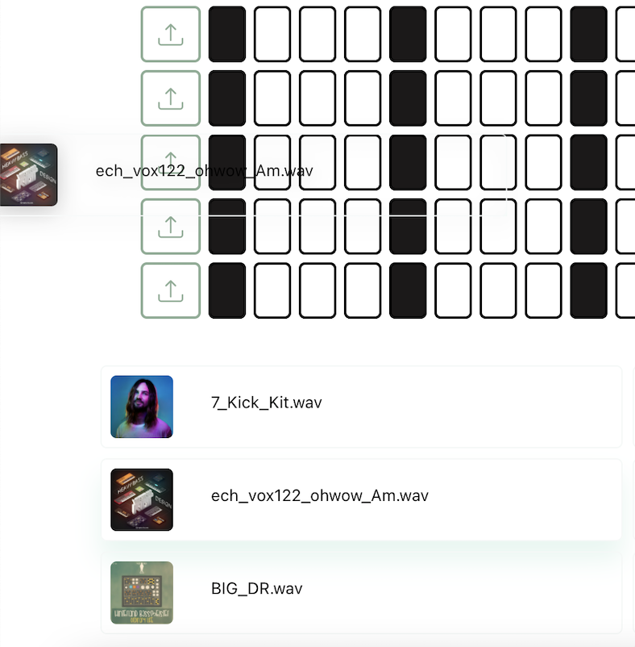

# SAMPLE CLOUD

## Installation

[client](https://github.com/Georgy87/SPLICE_PL_CLIENT-REACT): `npm run start`
<br/>
[server](https://github.com/Georgy87/SPLICE_PL_SERVER): `npm run start`

## Оглавление

1. [Описание проекта](#Описание-проекта)
2. [Регистрация](#Регистрация)
3. [Вход](#Вход)
4. [Главная страница](#Главная-страница)
5. [Профайл библиотеки](#Профайл-библиотеки)
6. [Профайл пользователя](#Профайл-пользователя)
	1. [Редактирование аватара](#Редактирование-аватара)
	2. [Редактирования почты и инициалов пользователя](Редактирования-почты-и-инициалов-пользователя)
	3. [Создание библиотеки(Pack)](#Создание-библиотекb(Pack))
## `Описание проекта`
SAMPLE CLOUD - это платформа для использования и создания библиотек с сэмплами. Платформа является источником для творчества музыкантов, саундпродюссеров, битмейкеров, звукоинженеров, а также просто любителей музыки. Пакеты с семплами созданы в самых разнообразных жанрах: от хип-хопа, хауса, техно, кинематографии до любых стилей между ними.

## `Регистрация`


## `Вход`

Вход в приложение по email и паролю:


## `Главная страница`

При удачной авторизации мы попадаем на главную страницу платформы. Здесь можно найти и прослушать демо библиотек с семплами(Packs).

<br/>


<br/>

`Поиск осуществляется по жанрам, а также авторам библиотек.`


`При нажатии на иконку play открывается плеер и включается проигрывание демо библиотеки.`


## `Профайл библиотеки`

`Выбрав библиотеку на странице main page открываем профайл с семплами.`


`Категорию семплов можно фильтровать по тегам`

`При наведении на семпл появляется возможность прослушать его, а также перемотать в нужное место при проигровании.`

[демо](https://disk.yandex.ru/i/OJFzGtyJR7_Pkw)

Добавить категорию семпла, а также его bpm можно в модальном окне, которое открывается при нажатии на крайний правый вертикальный эллипсис семпла:


## `Профайл пользователя`

Страница для редактирования профайла пользователя.


<br/>

### `Редактирование аватара`


<br/>


`Все, что нам нужно, это сделать дроп изображения. В результате получаем возможность вырезать нужный фрагмент из фото и сохранить результат.`


### `Редактирования почты и инициалов пользователя`


<br/>

### `Создание библиотеки(Pack)`

- Заполняем форму(pack information).


<br/>

- Загружаем обложку для библиотеки.


<br/>

- Загружаем аудио для библиотеки.


`Далее попадаем на страницу библиотек(Packs), созданных пользователем(см.загрузка семплов в библиотеку(PACK)).`

5. `Загрузка семплов в библиотеку(PACK).`

Для загрузки семплов в библиотеку заходим на странницу `PROFILE`


<br/>

`далее выбираем раздел Packs`

<br/>


Пользователь попадает на страницу созданных им библиотек(Packs). Здесь можно добавлять семплы просто дропнув их в соответствующую библиотеку.


На этом этапе я позволю себе более детально описать решения по оптимизации данного процесса.

1. `Получение, фильтрация и нормализация данных из загруженных пользователем файлов.`
   Когда пользователь загружает семплы в пакет(библиотеку семплов),

    
 
    мы получаем массив аудио файлов. От каждого из этих файлов нам нужно получить массив координат для отрисовки визуальной части аудио трека.

    <br/>

    К счастью, браузер предоставляет возможность получить такие данные при помощи Web Audio API. Мы получаем, так называемый, AudioBuffer(массив данных по аудио файлу).

    
    Далее нам нужно оптимизировать этот большой миллионный массив чисел перед отрисовкой визуализации наших аудио.

    <br/>

    Алгоритм фильтрации разделяет данные на 550 равных частей и вычисляет среднее значение выборок, а также убирает отрицательные числа. В итоге вместо миллионого массива данных мы получаем массив из 550 чисел.

    ```javascript
    private filterData(audioBuffer: AudioBuffer) {
		const rawData = audioBuffer.getChannelData(0);
		const samples: number = 550;
		const blockSize: number = Math.floor(rawData.length / samples);
		const filteredData: number[] = [];

		for (let i = 0; i < samples; i++) {
			let blockStart = blockSize * i;

			let sum = 0;
			for (let j = 0; j < blockSize; j++) {
				sum = sum + Math.abs(rawData[blockStart + j]);
			}
			filteredData.push(sum / blockSize);
		}
		return filteredData;
	}
    ```
    `Остается сделать нормализацию данных`. В массиве 550 дробных чисел от 0 до 1. Наш canvas имеет высоту 50 пикселей. Соответственно изменияем масштаб данных в промежутке от 1 до 50ти и округляем дробные числа. В результате мы имеем массив из 550ти целых чисел от 1 до 50ти.

    ```javascript
    private normalizeData(filteredData: number[]) {
		const multiplier = 50 / Math.max(...filteredData);
		return filteredData.map((n: number) => ((n * multiplier) + 1).toFixed());
	}
    ```

    Итог: Данная оптимизация позволяет во много раз уменьшить объем массива, который будет храниться в базе данных по каждому семплу(аудио треку), а также подготовить целые числа для отрисовки(избегаем субпиксельного рендеринга на canvas).

    ***

2. [`Webworker`](https://github.com/Georgy87/SPLICE_PL_CLIENT-REACT#worker).
   Цель данного этапа- отрисовка и создание png изображений по каждому загруженному треку.

    Имея массив координат, полученный на первом этапе, создаем холст при помощи технологии OffscreenCanvas и вместе с координатами отправляем postMessage в webworker. Отрисовываем данные на холсте по каждому семплу и при помощи canvas.convertToBlob() создаем изображения для отправки на сервер.

    <br/>

    ```javascript
    canvas.convertToBlob({ type: 'image/png' }).then((blob) => fileCreator(blob));

    function fileCreator(blob) {
    	const imageFile = new File([blob], 'png', { type: 'png' });

    	postMessage({ imageFile, audioFile, audioCoordinates, packId, fileId });
    }
    ```

     <br/>

    `Итог:`

   

    Мы получаем png изображения заранее отрисованной аудио волны по каждому семплу. При загрузке странницы с семплами, нам не придется каждый раз повторять процесс вычисления и отрисовки, либо, если все же понадобиться отрисовывать на canvas, эти изображения послужат маской, которая может ставиться перед реальной отрисовкой в real time.

### `SEQUENCER PAGE`[](https://github.com/Georgy87/SPLICE_PL_CLIENT-REACT#sequencer)


Секвенсор - это функционал для проигрывания семплов. Он включает семпл в определенный момент времени и работает c определенной скоростью bpm. Работа движка секвенсора осуществляется в хуке [useSequencer](https://github.com/Georgy87/SPLICE_PL_CLIENT-REACT/blob/main/src/hooks/useSequencer.ts)

При включении секвенсора пользователь может переключить bpm на панели:


`Пример изменения скорости проигрывания секвенсора:`

[demo](https://disk.yandex.ru/i/_dmonx9ha0gZ2A)

Некоторые семплы представляют собой фрагмент музыки c определенной скоростью(bpm), поэтому, загружая такие семплы, нужно выставлять bpm в секвенсоре.

[demo](https://disk.yandex.ru/i/rosSYCfpDKq-Ug)

Семплы, которые пользователь отметил лайком, попадают на страницу секвенсора. Перетаскиваем семпл на любую дорожку секвенсора в зеленый бокс.



 и кликаем место, в котором семпл должен начинать свое проигрывание. Оно выделяется синим цветом. 

при адаптации на мобильные устройства, так как мы не можем перетащить семплы в зеленый дроп бокс секвенсора, при нажатии на бокс появляется модальное окно, откуда можно загрузить соответствующий семпл выбрав его.


###### Секвенсор позволяет пользователю прослушать понравившиеся ему семплы в сочетании друг с другом в работе, приближенной к реальному музыкальному редактору.

<h1 color='#d9544f'>КРОССБРАУЗЕРНОСТЬ</h1>
<style>
  .crossHead {
    color: #d9544f;
  }
</style>

Приложение является кроссбраузерным, но в процессе теcтирования я столкнулся с некоторыми проблемами, которые хотел бы описать в этой главе.

1. `Процесс загрузки семплов в библиотеку.`

При загрузке файлов, описанной в главе [Webworker](https://github.com/Georgy87/SPLICE_PL_CLIENT-REACT#worker), технология [OffscreenCanvas](https://developer.mozilla.org/en-US/docs/Web/API/OffscreenCanvas)
на данный момент оказалась не совместима с Safari, Firefox и IE. Была написана функциональность, которая при определении данных браузеров, осуществляет отрисовку canvas без применения технологии OffscreenCanvas и webworker.

```javascript
const ctx: CanvasRenderingContext2D | null = canvas.getContext('2d');

  canvas.width = cssCanvasWidth * dpr;
  canvas.height = cssCanvasHeight * dpr;

  ctx?.scale(dpr, dpr);
  ctx?.translate(0, cssCanvasHeight / 2);

  const barWidth: number = cssCanvasWidth / audioCoordinates.length;

  if (ctx === null) return;

  ctx.strokeStyle = '#ADD8E6';
  ctx.beginPath();

  let cycleLimiter: number = 0;
  
  drawingTarget === 'Image' ? (cycleLimiter = audioCoordinates.length) : (cycleLimiter = percent);

  for (let i = 0; i < cycleLimiter; i++) {
    const x: number = barWidth * i;
    let barHeight: number = audioCoordinates[i];
    drawLineSegment(ctx, x, barHeight, barWidth, rectangleWidth);
  }

  ctx.stroke();

  function drawLineSegment(ctx: CanvasRenderingContext2D, x: number, barHeight: number, barWidth: number, rectangleWidth: number) {
    ctx.fillStyle = fillColor;
    ctx.fillRect(x + barWidth / 2, -(barHeight / 2), rectangleWidth, barHeight);
  }
```

Также при получении изображения, содержащегося не холсте canvas вместо технологии [OffscreenCanvas.convertToBlob()](https://developer.mozilla.org/en-US/docs/Web/API/OffscreenCanvas/convertToBlob) применяется [HTMLCanvasElement.toDataURL()](https://developer.mozilla.org/ru/docs/Web/API/HTMLCanvasElement/toDataURL) и затем уже утилитой:
```javascript
export const base64StringtoFile = (base64String: string, filename: string) => {
  let arr = base64String.split(','),
  
  mime = arr[0].match(/:(.*?);/)[1],
  bstr = atob(arr[1]),
  n = bstr.length,
  u8arr = new Uint8Array(n);
while (n--) {
  u8arr[n] = bstr.charCodeAt(n);
}
return new File([u8arr], mime, { type: 'png' });
};
```
создаем файл изображения для отправки на сервер.

2. `Движок секвенсора.`
При тестировании работы секвенсора, описанного в главе [SEQUENCER PAGE](https://github.com/Georgy87/SPLICE_PL_CLIENT-REACT#sequencer), в Safari работа c [Web Audio API](https://developer.mozilla.org/ru/docs/Web/API/Web_Audio_API) дала сбой при запуске движка. Проблема была решена использованием [AudioContext.resume()](https://developer.mozilla.org/en-US/docs/Web/API/AudioContext/resume)
